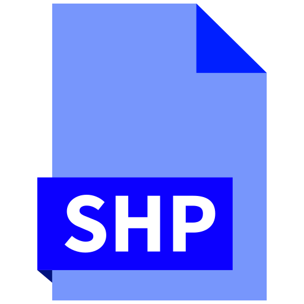

## Development Programming Languages and Tools

This page contains a list of programming languages and development tools that I've used throughout the years.

 

### 🔠 Programming Languages

Click to expand list of programming languages

<code><b>JavaScript</b></code>&nbsp;
<code><b>TypeScript</b></code>&nbsp;
<code><b>WebGL</b></code>&nbsp;
<code><b>Java</b></code>&nbsp;
<code><b>PHP</b></code>&nbsp;
<code><b>C</b></code>&nbsp;
<code><b>C++</b></code>&nbsp;
<code><b>C#</b></code>&nbsp;
<code><b>R</b></code>&nbsp;
<code><b>Visual Basic 6</b></code>

 

### 🖥️ Scripting

Click to expand list of scripting languages

<code><b>Bash Scripts</b></code>&nbsp;
<code><b>Batch Scripts</b></code>&nbsp;

 

### 📚 Frameworks and Libraries

Click to expand list of frameworks and libraries

<code><b>React</b></code>&nbsp;
<code><b>Redux</b></code>&nbsp;
<code><b>NextJS</b></code>&nbsp;
<code><b>Vue</b></code>&nbsp;
<code><b>Jest</b></code>&nbsp;
<code><b>CodeIgniter</b></code>&nbsp;
<code><b>Laravel</b></code>&nbsp;
<code><b>ThreeJS</b></code>&nbsp;
<code><b>jQuery</b></code>&nbsp;
<code><b>Axios</b></code>&nbsp;

 

### 🎨 Frontend

Click to expand list of markup and CSS styling libraries

<code><b>HTML5</b></code>&nbsp;
<code><b>CSS3</b></code>&nbsp;
<code><b>Bootstrap</b></code>&nbsp;
<code><b>Material UI</b></code>&nbsp;
<code><b>Tailwind CSS</b></code>&nbsp;

 

### 🏗️ Backend

Click to expand list of backend tools

<code><b>Node</b></code>&nbsp;
<code><b>Express</b></code>&nbsp;
<code><b>Nginx</b></code>&nbsp;
<code><b>PM2</b></code>&nbsp;
<code><b>Xampp</b></code>&nbsp;
<code><b>Apache</b></code>&nbsp;
<code><b>GeoServer</b></code>&nbsp;
<code><b>Nodemon</b></code>&nbsp;

 

### 🛢️ Databases

Click to expand list of databases

<code><b>MongoDB</b></code>&nbsp;
<code><b>PostgreSQL</b></code>&nbsp;
<code><b>MySQL</b></code>&nbsp;
<code><b>SQLite</b></code>&nbsp;

 

### 📦 Cloud

Click to expand list of cloud services

<code><b>Firebase</b></code>&nbsp;
<code><b>Amazon Web Services</b></code>&nbsp;
<code><b>Heroku</b></code>&nbsp;
<code><b>Vercel</b></code>&nbsp;
<code><b>Render</b></code>&nbsp;
<code><b>Microsoft Azure</b></code>&nbsp;
<code><b>MongoDB Atlas</b></code>&nbsp;
<code><b>Stripe</b></code>&nbsp;

 

### 🌎 Domain Name System (DNS)

Click to expand list of domain name system (DNS) tools

<code><b>AWS Route 53</b></code>&nbsp;
<code><b>Let's Encrypt</b></code>&nbsp;

 

### 🌐 Web Mapping

Click to expand list of web mapping libraries and tools

<code><b>LeafletJS</b></code>&nbsp;
<code><b>MapBox</b></code>&nbsp;
<code><b>QGIS</b></code>&nbsp;

 

### 🎮 Game Development

Click to expand list of game development tools

<code><b>Unity3D</b></code>&nbsp;
<code><b>JavaScript</b></code>&nbsp;
<code><b>HTML5</b></code>&nbsp;
<code><b>GameMaker</b></code>&nbsp;

 

### 📱 Mobile Devices

Click to expand list of mobile devices

<code><b>Android</b></code>&nbsp;

 

### 🛠️ Development Tools

Click to expand list of development tools

<code><b>ESLint</b></code>&nbsp;
<code><b>Webpack</b></code>&nbsp;

 

### 📝 Integrated Development Editors (IDEs)

Click to expand list of integrated development editors (IDEs)

<code><b>VSCode/Cursor</b></code>&nbsp;
<code><b>Android Studio</b></code>&nbsp;
<code><b>Microsoft Visual Studio</b></code>&nbsp;

 

### 📂 Version Control and Public Repositories

Click to expand list of tools for version control and public repositories

<code><b>Git</b></code>&nbsp;
<code><b>Tortoise SVN</b></code>&nbsp;
<code><b>GitHub</b></code>&nbsp;
<code><b>GitHub Actions</b></code>&nbsp;
<code><b>GitLab</b></code>&nbsp;
<code><b>BitBucket</b></code>&nbsp;
<code><b>NPM Registry</b></code>&nbsp;

 

### 💾 Operating Systems and Tools

Click to expand list of operating systems and tools

<code><b>Windows</b></code>&nbsp;
<code><b>Ubuntu</b></code>&nbsp;
<code><b>Virtual Box</b></code>&nbsp;
<code><b>Docker</b></code>&nbsp;

 

### 🧰 Other Libraries and Tools

Click to expand list of other ibraries and tools

<code><b>Electron</b></code>&nbsp;
<code><b>Sequelize</b></code>&nbsp;
<code><b>FileZilla</b></code>&nbsp;

 

### 📄 File Formats/Specifications

Click to expand list of file formats/specifications

<code><b>OpenAPI</b></code>&nbsp;
<code><b>JSON</b></code>&nbsp;
<code><b>GeoJSON</b></code>&nbsp;
<code><b>Shapefile</b></code>&nbsp;

 

### 📊 Diagraming Tools

Click to expand list of diagraming tools

<code><b>Draw IO</b></code>&nbsp;
<code><b>Excalidraw</b></code>&nbsp;
<code><b>Dia</b></code>

 

### 📐 Software Documentation and Project Planning

Click to expand list of software documentation and project planning tools and templates

<code><b>Ready Set</b></code> <i>(Used in conjunction with other modern software development planning and documentation templates)</i>

 

### 💡 Others

Click to expand list of other tools

<code><b>Adobe Photoshop</b></code>&nbsp;
<code><b>Adobe After Effects</b></code>&nbsp;
<code><b>3DS Max</b></code>&nbsp;

 