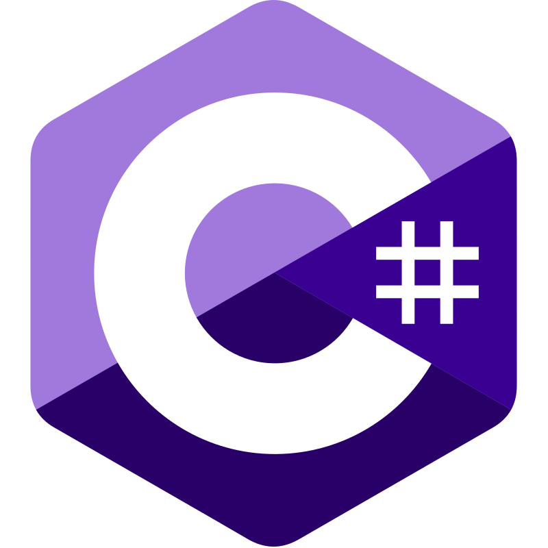

# Hi, I'm weaponsforge 

I'm a polyglot developer who tests, tries, and experiments with all sorts of stuff, prioritizing quality over quantity. Always learning, I love to design and create interesting things.

### Languages and Tools <a href="DEV_TOOLS.md">🌟 Full List 🌟</a>

  

  

    <!-- Programming Languages -->
    <code></code>
    <code></code>
    <code></code>
    <code></code>
    <code></code>
    <code></code>
    <code></code>
    <code></code>
    <code></code>
    <code></code>
    <code></code>
    <!-- Scripting -->
    <code></code>
    <code></code>
    <!-- Frameworks and Libraries -->
    <code></code>
    <code></code>
    <code></code>
    <code></code>
    <code></code>
    <code></code>
    <code></code>
    <code></code>
    <code></code>
    <code></code>
    <!-- Development Tools -->
    <code></code>
    <code></code>
    <!-- IDEs -->
    <code></code>
    <code></code>
    <!-- Other Libraries and Tools -->
    <code></code>
    <code></code>
    <code></code>
    <!-- Web Mapping Libraries -->
    <code></code>
    <code></code>
    <code></code>
    <!-- CSS Styling libraries -->
    <code></code>
    <code></code>
    <code></code>
    <!-- Backend -->
    <code></code>
    <code></code>
    <code></code>
    <code></code>
    <code></code>
    <code></code>
    <code></code>
    <code></code>
    <!-- Databases -->
    <code></code>
    <code></code>
    <code></code>
    <code></code>
    <!-- Cloud -->
    <code></code>
    <code></code>
    <code></code>
    <code></code>
    <code></code>
    <code></code>
    <code></code>
    <code></code>
    <!-- DNS -->
    <code></code>
    <!-- Version Control, repositories -->
    <code></code>
    <code></code>
    <code></code>
    <code></code>
    <code></code>
    <code></code>
    <code></code>
    <!-- Operating Systems, tools -->
    <code></code>
    <code></code>
    <code></code>
    <code></code>
    <!-- Mobile Devices -->
    <code></code>
    <!-- Others -->
    <code></code> 
    <code></code>
    <code></code>
  

### My Key Technologies / Current Stack

| <b>M</b> | <b>E</b> | <b>R</b> | <b>N</b> |  |
| :---: | :---: | :---: | :---: | :---: |
| <code></code>  MongoDB | <code></code>  Express | <code></code>  React/NextJS | <code></code>  Node | <code></code>  Firebase |

### Research Interests

- Image Analysis
- Augmented Reality (AR)
- Virtual Reality (VR)
- WebGL

### Topics of Interest

Software architecture analysis and design, Web Development, JavaScript frameworks for front-end and backend, 3D graphics, 3D modelling and animation, Web Mapping, DevOps, CI/CD, NodeJS, Docker, SQL and NoSQL databases, Web3, Blockchain, Firebase

### Active Goals

- Building custom software as tools for personal use and sharing them with people having similar needs
- Learning the capabilities of modern/generative AI for providing more robust and creative solutions for solving problems

### Holopin Badges

