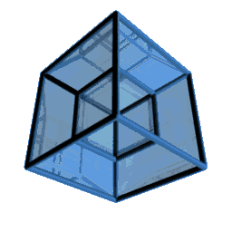

# Hi, I'm weaponsforge 

I'm a curious programmer who tests, tries, and experiments with all sorts of stuff.
   

### Research Interests

- Image Analysis
- Augmented Reality (AR)
- Virtual Reality (VR)
- WebGL

### Topics of Interest

- Web Development
- 3D graphics, modelling, animation
- JavaScript frameworks for front-end and backend
- DevOps, CI/CD
- NodeJS
- Docker
- SQL and NoSQL databases
- Web3, Blockchain
- Firebase

**Languages and Tools**

<code></code>
<code></code>
<code></code>
<code></code>
<code></code>
<code></code>
<code></code> 
<code></code>
<code></code>
<code></code>
<code></code>
<code></code>
<code></code>
<code></code>
<code></code>
<code></code>
<code></code> 
<code></code>
<code></code>
<code></code>
<code></code>
<code></code>
<code></code>
<code></code>
<code></code>
<code></code>
<code></code>
<code></code>
<code></code>
<code></code>

  

